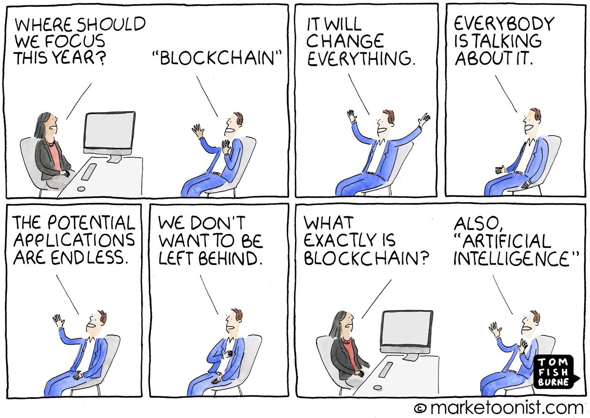
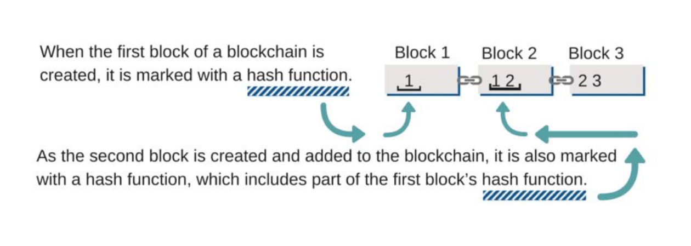
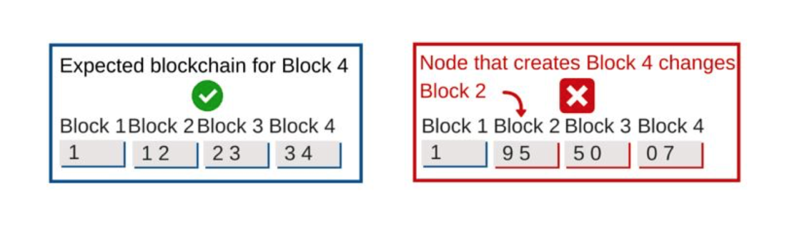
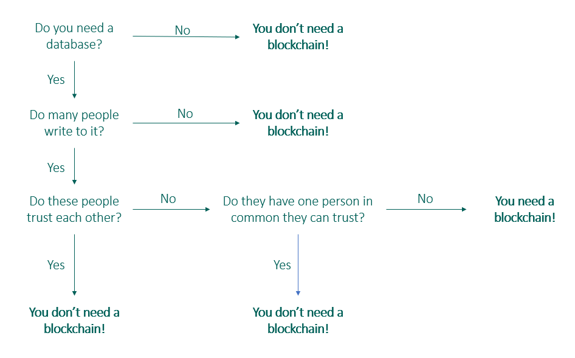

# The Story Of Villagers, Marbles And Oh, A Blockchain!

 {{ $frontmatter.date }} 

 

Let’s hear a story. 🙂

In a faraway magical land (no, not Narnia) lived people who loved marbles. Their lives revolved around marbles. They adored marbles, traded marbles, lent and borrowed them from each other.

One not-so-fine day, a fight broke out.

A claims she lent five marbles to B and wants them back, but B blatantly refuses. All the villagers gather to help A and B, but nobody can determine who is telling the truth. (No Record of Truth)

When more such incidents began to occur, H proclaims herself the head of the town and proposes a solution to always maintain a notebook and write down all the marble transactions that happen, that way nobody could cheat anybody. Everybody loved the idea and maintained a notebook every time they lent or borrowed marbles. (Database)

Just as the village starts living in harmony again, a fire breaks out at the Central Palace. The notebook is charred and holds no transaction records anymore. This time when A demands her marbles back from B, taking advantage of the situation, B denies. (Single Point of Failure)

All the villagers come together again to discuss what can be done. H, once again rising to the occasion, suggests that they shall maintain multiple notebooks with the same records. Everybody loves the idea and elect five people to maintain a notebook each. Now, no single notebook could determine their fate. (Distributed Database)

All is well, all the villagers are happy with their lovely marbles. All too sudden, H misplaces all of her marbles. She searches and then some more, but to no avail. She owed several marbles to others. She was bankrupt! H found a cunning way out. She speaks to all the five people maintaining notebooks, and convinces them to alter all transactions where she owed marbles. With all notebooks reflecting this change, others ended up giving their marbles to H and she found a way to be rich again! (Centralization)

When this starts to happen again and then again, eventually the villagers find out the truth. H is now banished from the village. The villagers ponder and look for a flawless solution. Eureka! They decide that every villager shall maintain a notebook; each person shall hold a record of all the marble transactions. Now, no one person has the power to alter all records. (Decentralization)

Normalcy returned, and everybody was happy with the new solution. One day, four goons masquerading as villagers try to fraudulently change a record in their notebooks, hoping to illegally gain more marbles. When everybody else came across this transaction while updating their notebooks, their notebooks did not seem to sync with this new transaction. Hence, they deem it fraudulent and do not add it on to their notebooks. (Consensus)

Thus they ensured harmony at the magical village and lived happily ever after. 🙂

The final solution arrived at by the villagers in the story is what is called a blockchain. Blockchain is a digital, decentralized ledger which records all transactions chronologically and publicly. As can be observed from the story, blockchain offers immutability, transperancy and decentralization. It eliminates the need for middlemen. It can be said that blockchain offers “digital trust”.

> “Blockchain is to transaction what the Internet is to information.”

On a very high level, a bunch of transactions are grouped together to form a “block”. Several such blocks are linked together to form a chain; hence block-chain.

The images below can help us understand better:

When a node fraudulently tries to modify one of the previous records, the hash function of that block changes, and thus changes the hash of every other block on the chain. Thus, this transaction is deemed invalid and is not accepted onto the blockchain. This method of “accepting” blocks or transactions onto the blockchain is called consensus. There are different protocols used to establish this consensus, some being [Proof of Work](https://en.wikipedia.org/wiki/Proof_of_work) — the protocol used by Bitcoin, [Proof of Stake](https://en.wikipedia.org/wiki/Proof_of_stake), etc.

Let us consider another very interesting problem that Blockchain solves — the [Double Spending](https://en.wikipedia.org/wiki/Double-spending) problem.

In the story above, consider “digital marbles”, instead of just marbles. When I give you a marble, you have a marble and I don’t. That marble is yours. Consider the real world scenario with money. When I give you a hundred rupee note, the note is yours to spend. There is no way I can spend the same hundred rupees.

But think of the digital world. What if I made copies of the marble before lending it? How do you absolutely make sure that I do not “double spend” the hundred rupees I am lending to you? This is a problem that has baffled many people and until a few years back, the only solution seems to have been to have a middleman. For instance, banks act as the middleman and ensure there is no double spending. Blockchain intelligently tackles the problem of double spending. The immutability and consensus mechanism ensure that a token (a marble, a hundred rupee note, the famous Bitcoin) that is at a risk to be “double spent” is not accepted onto the blockchain.

> “Blockchain is to Bitcoin, what the Internet is to email. A big electronic system on top of which you can build applications. Currency is just one.”

I love this line. It rings so true. With [RansomWare](https://en.wikipedia.org/wiki/Ransomware) demanding Bitcoin, Bitcoin hitting an all-time high recently, etc. Bitcoin has become incredibly popular. However, Blockchain — the technology driving Bitcoin has tremendous scope beyond cryptocurrencies too.

Think of an election. What if you could really ensure “One man, one vote”? What if it was clearly evident and absolutely transparent that your votes on an election could never be rigged?
Some countries have already begun to use blockchain for their elections. Sierra Leone was the first country to hold blockchain powered elections. ([Link to news article.](https://yourstory.com/2018/03/sierra-leone-blockchain-powered-elections/))

What if you could truly own your identity? ([UPort](https://www.uport.me/) works on blockchain driven identity management.) Your data would not be stored on centralised servers prone to attacks, and only you would be in charge of your identity.

A world where artists, researchers shall never be denied of their due credit because blockchain ensures a chain of ownership.

A vote, identity, a song, a piece of poetry, a research paper, etc. are “tokens” on the blockchain. Just like Bitcoin.

Blockchain also holds great promises in the world of FinTech for KYC, remittances, letter of credit, trade finance and more. It has the potential to significantly reduce costs for several internal processes within banks.

Before I wrap up — there are lots of use cases that blockchain can solve and are best solved with blockchain. However, with a lot of hype surrounding the relatively new technology, it is important to ensure that we only use a blockchain when we really need one.

The image below is self-explanatory and beautifully summarises when you should go for a blockchain.

When I first started exploring blockchain, it took me ages to ease into it. Probably because it seemed so unintuitive at first and so different than any other technology; probably because the technicalities dive deep into concepts of cryptography, hashing, networks, and more. I hope you find this article useful and is a good primer, or a new perspective on the technology.
