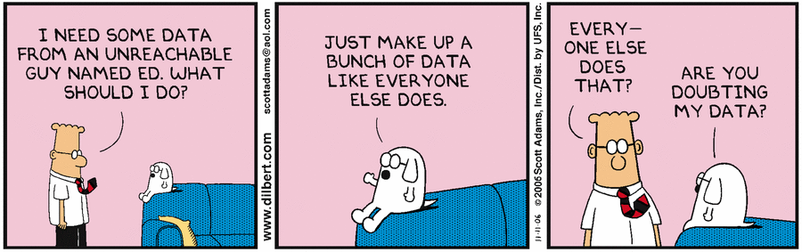
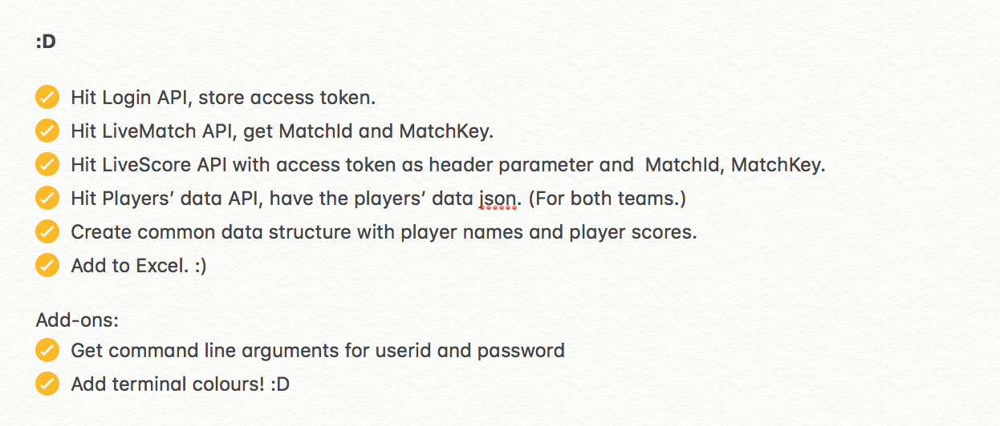
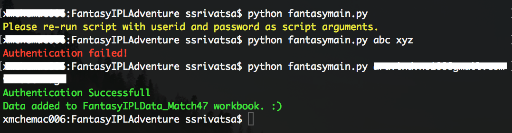

# Getting Your Hands On Fantasy Data 🏏

 {{ $frontmatter.date }} 

 

Come April and May, and the country is gripped with the IPL fever.
What has gained amazing popularity in the recent past is Fantasy cricket. A friend of mine, an ardent Fantasy Cricket player and a huge fan of data science, decided to try leveraging data to pick the future players in the team. The only pain point was, of course — Data. Manually creating a dataset of the Bat, Bowl and Field scores of all players of both teams, is indeed too laborious.

I am a huge fan of cricket, love how promising the right data can be, and an engineer at heart. So I decided to jump in and write a script that would help in gathering the Fantasy IPL data.

My first instinct was to scrape it with some BeautifulSoup and Python. As I begun exploring the user flows on the website and wandered through a lot of tags with Inspect Element, I came across a few hurdles and a few insights. Due to some glitches, I found scraping the Fantasy scores not as straight forward as I would have liked, and the more I inspected, the more I liked the approach of directly receiving scores from the Fantasy server. So, so I did! 🙂

Here is a snapshot of my little Mind Map as I wrote the script, and pretty much summarises all I did!

To use the script, run it with the Fantasy League userid and password as command line arguments.

This generates an Excel file with the Bat, Bowl and Field scores of all players from both the participating teams.

Here is the script. I wrote the script with the idea of retrieving the scores for the IPL match that was most recently played. You could also easily modify it to retrieve scores of all matches. (Something you couldn’t do with just scraping.)

The script can further be leveraged to create a dataset of all the Fantasy scores, and I believe would indeed be an interesting data science problem. I haven’t been able to get around to doing it yet, but would be lovely if somebody out there could dig into and leverage this script to create a dataset! 🙂
