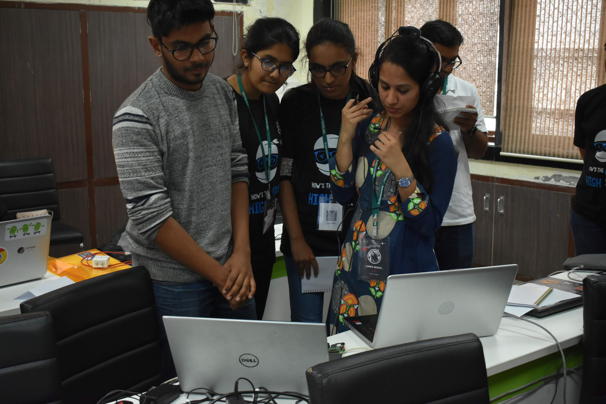
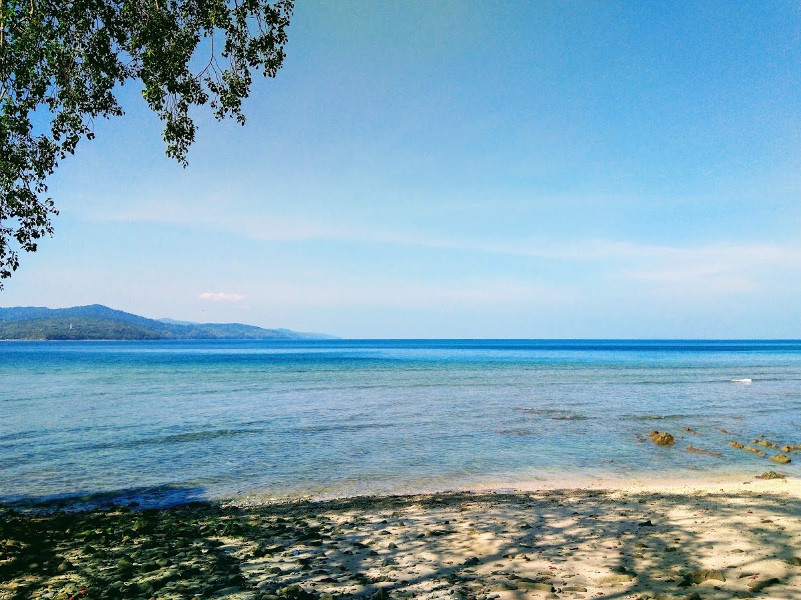
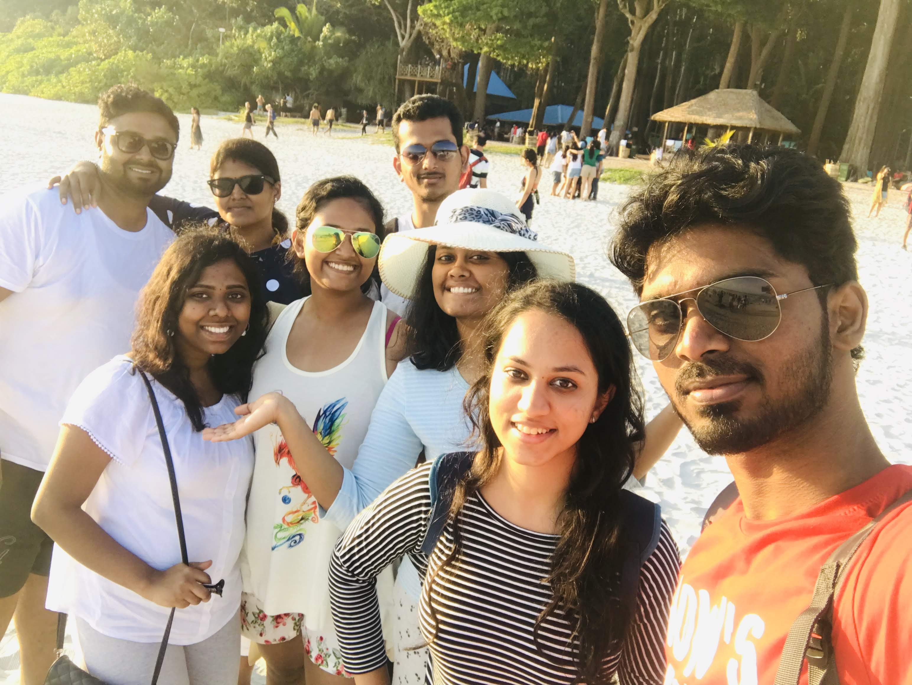
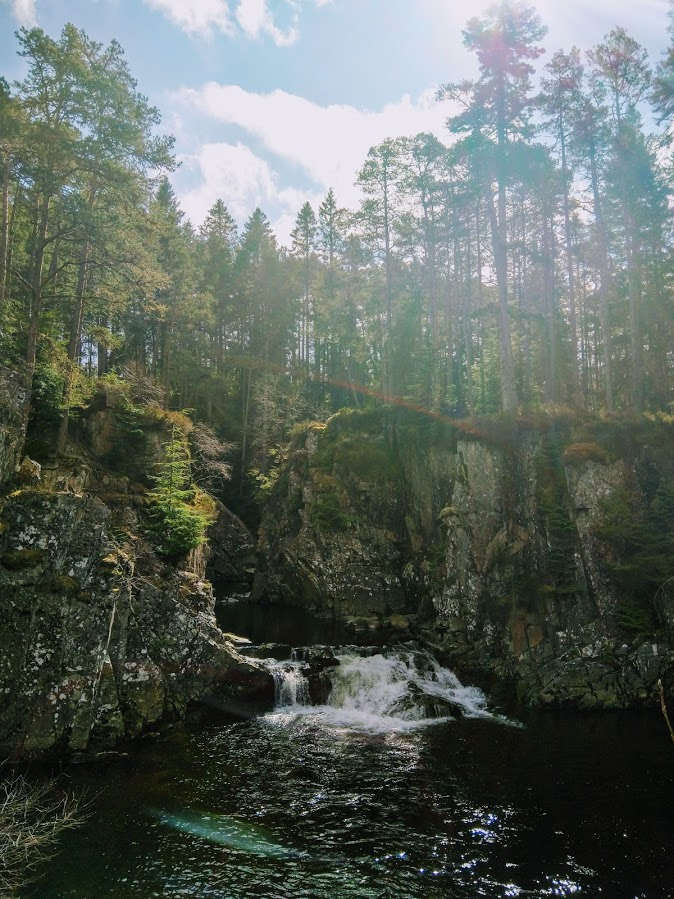
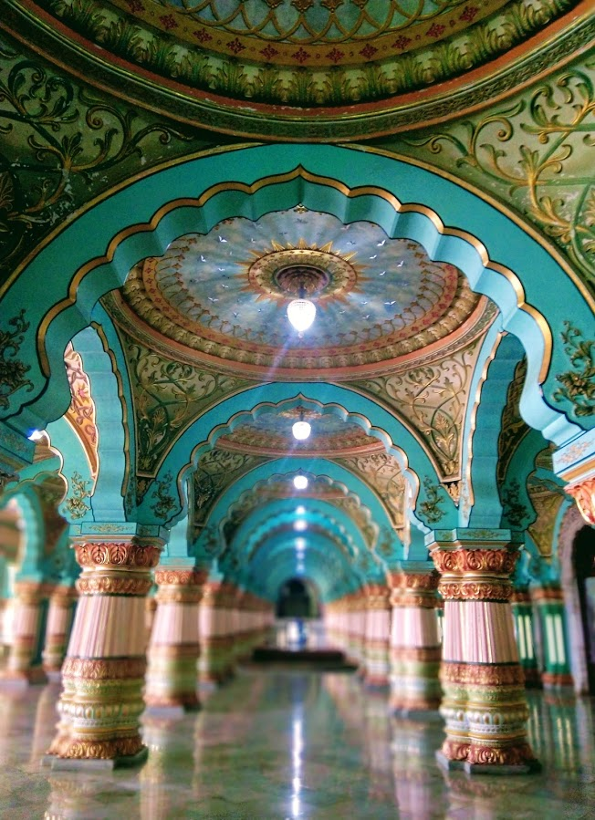
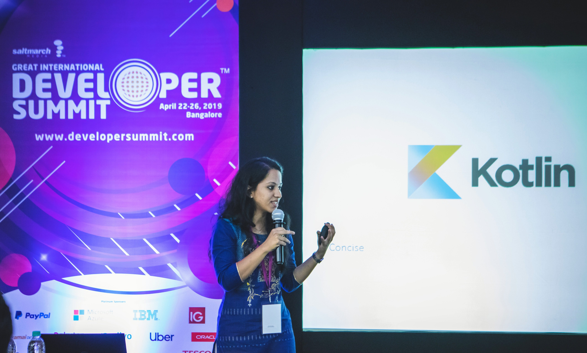

# My 2019 💜

That’s the gist of my 2019!

<blockquote class="twitter-tweet">
My 2019: 💜 🤕 Began with a bad leg injury 👩‍💼 Judge at two awesome hackathons 🎙️ Spoke at my first overseas conference 🌄 Solo tripped Scotland and Mysore 🧠 Took a break from work for mental health 😃 Moved to Bangalore, joined Atlassian ✨
&mdash; Supriya Srivatsa (@SupriyaSrivatsa) <a href="https://twitter.com/SupriyaSrivatsa/status/1212012490084646912?ref_src=twsrc%5Etfw">December 31, 2019</a></blockquote> 

When I was writing this tweet, so many memories and emotions came rushing, a tweet didn’t seem enough.

So here I go.

On New Years’ Eve ’19, when most of my friends were partying, I welcomed the new year by hopping around my room on one leg. This injury seems significant in the past year to me, because in a sense, I literally learned to walk again. And got so much love and support from my family. <3 From minimal movement to hopping around on one leg, to limping to being able to walk, it almost feels like a journey. (No pun intended.🤭)

In February, I was invited to judge DotSlash hackathon at NIT Surat, and HackHer, Kurukshetra at CEG, Chennai. So much energy and enthusiasm at the hackathons! And so humbling to judge them! 

  

In March, I had an amazing vacation at Andaman with some of my favourite people!<3 Andaman is stunningly beautiful.

  

    
  

  

    
  

I also solo tripped Edinburgh and Isle of Skye, and later closer to home, Mysore.

  

    
  

  

    
  

I spoke at my first overseas conference at ACCU Conference in Bristol in April, and had a wonderful experience! :) I also spoke at GIDS at IISc, Bangalore later; always an incredible experience for the crowd is so inspiring! :)

With 2019 came the Cricket World Cup, and with it came heartbreak. 💔 It was heartbreaking to see India lose the semifinals. And then see the Kiwis lose at the Finals, especially the way they did. For many days after the world cup, and even today, my heart sinks at the memory of the world cup. 😟

If I were to say one thing that comes to me at the mention of “2019”, it is mental health. 2019 was super difficult for me because of terrible, heart wrenching anxiety. Even as I type this, my stomach scrunches up at the memories and feelings. Accepting and making conscious efforts to overcome my anxiety has been both my biggest challenge and biggest achievement of 2019. I took a break from work to focus on my mental health and heal. Leaving my job to take a break was no easy decision either. It brought along with it loads of uncertainty. But that’s what I needed, and I’m so glad I did it! It helped a ton. 🙂

I like to think that I am ending 2019 with a much stronger grasp on data structures and algorithms than I had at the beginning of the year. I so enjoyed the problem solving! Along the way, I gained some wonderful and some terrible interview experiences; all of them lessons nonetheless. 

I also explored art - clicking travel photos, doodling and zentangles, colouring - a lot more this past year. 🎨 Oo and I also created this website you're reading this blog on! 😊

Towards the end of the year, I moved to Bangalore, joined Atlassian, and have been having a great time! :)

 
To many more experiences and joy in 2020!  🥂